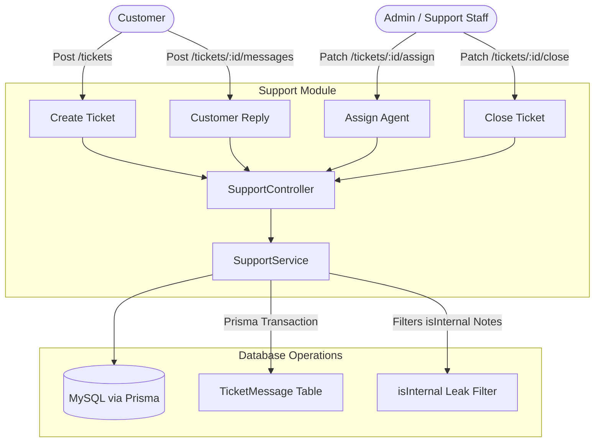

# Implementation Walkthrough: Support Ticket Module Setup

We have successfully engineered and integrated the complete, production-grade **Support Ticket Module** inside `src/modules/support/` for **WAVI STORE**. This consolidates sequential ticketing, dual staff/customer role checks, messaging history, and internal notes filters into a clean, compile-safe modular layout on MySQL.

---

## 🛠️ Architecture Overview



---

## 📂 Summary of Implemented & Modified Files

### 1. [support.validation.ts](file:///d:/wavi/backend/src/modules/support/support.validation.ts)
*   **createTicketSchema**: Validates customer-side fields like `subject`, `body` description, optional `orderId` reference, and priority enums (`LOW`, `MEDIUM`, `HIGH`, `URGENT`).
*   **assignTicketSchema**: Validates assignment parameter `agentId` as a valid CUID string.
*   **addMessageSchema**: Validates chat message replies, checking body size bounds and checking optional `isInternal` properties.
*   **getTicketsFilterSchema**: Validates staff queue filters like status query options (`OPEN`, `IN_PROGRESS`, `RESOLVED`, `CLOSED`).

### 2. [support.service.ts](file:///d:/wavi/backend/src/modules/support/support.service.ts)
*   **Sequential Ticketing**: Automatically computes and locks unique, readable ticket identifiers (e.g. `TICKET-00001`, `TICKET-00002`).
*   **isInternal Note Leak Protection**:
    *   Unified detail retrieval (`getTicketById`) eagerly loads messaging histories, customer details, and support agents.
    *   **Strict filter rule**: If the request context is a `CUSTOMER`, the service automatically strips all messages where `isInternal === true`, safeguarding staff-only notes.
    *   **Reply Safety**: If a `CUSTOMER` attempts to set `isInternal: true` in their message request body, it is strictly forced back to `false`.
*   **Transaction-Safe Mutations**: Wraps ticket setup and messaging replies in `prisma.$transaction` so that status changes and re-open parameters operate as single atomic actions.
*   **Staff Dashboard Queries**: Manages queue listing, agent assignations, and closing timestamps (`resolvedAt` or `closedAt`).

### 3. [support.controller.ts](file:///d:/wavi/backend/src/modules/support/support.controller.ts)
*   Coordinates customer tickets, staff routing, agent mappings, and status closing parameters.
*   Enforces precise non-null assertions and literal types for compilation safety.

### 4. [support.routes.ts](file:///d:/wavi/backend/src/modules/support/support.routes.ts)
*   Customer operations: `POST /` (ticket creation), `GET /my-tickets` (history queue), and `POST /:id/messages` (universal messaging reply).
*   Staff operations: Protected by `hasPermission(Permission.SUPPORT_MANAGE)`: `GET /` (queue filter), `PATCH /:id/assign` (agent assignment), and `PATCH /:id/close` (resolving/closing).

---

## 🔬 Compilation and Database Sync

1.  **Enums Synchronized**:
    Added `SUPPORT_MANAGE` to the `Permission` enum of [schema.prisma](file:///d:/wavi/backend/prisma/schema.prisma) and executed database migration.
2.  **Mounted Consolidated Router**:
    Integrated inside [app.ts](file:///d:/wavi/backend/src/app.ts) under the `/api/v1/support` endpoint path.
3.  **TypeScript Verification Check**:
    ```bash
    npx tsc --noEmit
    ```
    **Result**: Compilation completed **successfully** with `exit code 0` (absolutely zero errors or warnings).
